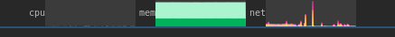

# system-monitor-sway

Stacked CPU, memory, network, and optional disk / swap / freq / GPU / thermal / fan / battery graphs for **Sway**, matching [gnome-shell-system-monitor-applet](https://github.com/paradoxxxzero/gnome-shell-system-monitor-applet). A small overlay sits in the **center of Waybar**. GNOME is not required.



## Install

Packaged installs (Arch AUR, Fedora COPR, pipx/PyPI) are described in
[packaging/README.md](packaging/README.md). Manual install:

### 1. Packages

Ubuntu / Debian:

```bash
sudo apt install python3 python3-gi gir1.2-gtop-2.0 libgtk-layer-shell0 gir1.2-gtklayershell-0.1
```

Install **both** `libgtk-layer-shell0` and `gir1.2-gtklayershell-0.1` (Python needs the GIR package).

Arch: `sudo pacman -S python python-gobject libgtop gtk-layer-shell`
Fedora: `sudo dnf install python3-gobject libgtop gtk-layer-shell`

### 2. Program

```bash
sudo ./install.sh
mkdir -p ~/.config/system-monitor-sway
cp /usr/local/share/system-monitor-sway/config.json ~/.config/system-monitor-sway/
```

No root: `./install.sh "$HOME/.local"` and copy from `~/.local/share/system-monitor-sway/config.json` (keep `~/.local/bin` on `PATH`).

Match `bar_height` in that config to Waybar’s `"height"` (both default `30`). Leave Waybar `"modules-center"` empty.

### 3. Autostart

Put this in `~/.config/sway/config` in the **autostart / `exec` section** (same place as Waybar, mako, etc.). Not inside a `bar { }` block.

Use a **full path** (Sway’s `PATH` is often shorter than your terminal’s):

```bash
exec waybar
exec /usr/local/bin/system-monitor-sway
```

If you installed with `./install.sh "$HOME/.local"`:

```bash
exec /home/YOU/.local/bin/system-monitor-sway
```

`exec` runs **once at login**, not on `swaymsg reload`. After adding the line, either log out/in or:

```bash
swaymsg exec /usr/local/bin/system-monitor-sway
```

Do **not** use `exec_always` for the monitor unless you `pkill` it first — reload would start a second copy. `exec_always waybar` for Waybar is fine.

## Configure

Edit `~/.config/system-monitor-sway/config.json`. Changes apply on the next start (`pkill` the process, then `swaymsg exec …`). `swaymsg reload` does not re-read the file.

Lookup, first file that exists wins:

1. `~/.config/system-monitor-sway/config.json` (`$XDG_CONFIG_HOME` if set)
2. `/etc/system-monitor-sway/config.json`
3. `/usr/local/share/system-monitor-sway/config.json` or `/usr/share/…`
4. `config.json` next to the program

Override with `system-monitor-sway -c /path/to/config.json`. Missing keys use the defaults below. Omitted graphs stay off; a partial block such as `"disk": { "display": true }` fills in the rest.

### Top-level

| Key | Default | Role |
|-----|---------|------|
| `bar_height` | `30` | Overlay height in px. Must match Waybar `height`. Charts use this height |
| `graph_width` | `100` | Default chart width in px when an element omits `graph_width` |
| `element_spacing` | `4` | Gap between graphs in px |
| `background` | `#ffffff16` | Chart background (`#rrggbb` or `#rrggbbaa`) |
| `layer_shell_layer` | `overlay` | `overlay`, `top`, `bottom`, or `background`. `overlay` draws on top of Waybar |
| `show_tooltip` | `true` | Hover popover with stats |
| `tooltip_delay_ms` | `1000` | Delay before the popover. `0` shows it immediately |
| `layer_shell_margin_top` | `-bar_height` | Top inset. The default pulls the strip onto Waybar; set this only if the overlap is wrong |
| `elements` | cpu, memory, net | Graph objects, keyed by name |

### Per graph (`elements.<name>`)

Names: `cpu`, `freq`, `memory`, `swap`, `net`, `disk`, `gpu`, `thermal`, `fan`, `battery`.

| Key | Default | Role |
|-----|---------|------|
| `display` | `true` for cpu / memory / net, `false` otherwise | Draw this graph |
| `position` | cpu `0` … battery `9` (see table below) | Left-to-right order |
| `label` | the name (`mem` / `batt` for memory / battery) | Text before the chart |
| `show_label` | `true` (`false` for freq) | Show `label` |
| `style` | `graph` | `graph` or `both` draw the chart. Any other value (including GNOME’s `digit`) is label-only |
| `refresh_ms` | see table (minimum `500`) | Sample period |
| `graph_width` | top-level `graph_width` (`100`) | Chart width in px |
| `colors` | GNOME defaults | One `#rrggbb` per stacked layer, listed bottom to top |

Thermal only:

| Key | Default | Role |
|-----|---------|------|
| `sensor_file` | `/sys/devices/virtual/thermal/thermal_zone0/temp` | Sysfs millidegree temperature |
| `fahrenheit_unit` | `false` | Tooltip in °F. The graph is still °C |

Fan only:

| Key | Default | Role |
|-----|---------|------|
| `sensor_file` | `/sys/devices/virtual/thermal/cooling_device0/cur_state` | Sysfs integer (GNOME treats it as rpm) |

### Graphs

The shipped file lists only cpu, memory, and net. JSON cannot comment, so the others are omitted and stay off. To enable one, add it under `elements`:

```json
"disk": { "display": true }
```

| Name | `display` | `position` | `refresh_ms` | `colors` (layers) | Source |
|------|-----------|------------|--------------|-------------------|--------|
| `cpu` | `true` | `0` | `1500` | user, system, nice, iowait, other (`#0072b3` `#0092e6` `#00a3ff` `#002f3d` `#001d26`) | libgtop |
| `freq` | `false` | `1` | `1500` | freq (`#001d26`) | average `scaling_cur_freq` (MHz) |
| `memory` | `true` | `2` | `5000` | program, buffer, cache (`#00b35b` `#00ff82` `#aaf5d0`) | libgtop |
| `swap` | `false` | `3` | `5000` | used (`#8b00c3`) | libgtop |
| `net` | `true` | `4` | `1000` | down, downerrors, up, uperrors, collisions (`#fce94f` `#ff6e00` `#fb74fb` `#e0006e` `#ff0000`) | libgtop + `/proc/net/dev` |
| `disk` | `false` | `5` | `2000` | read, write (`#c65000` `#ff6700`) | `/proc/diskstats` |
| `gpu` | `false` | `6` | `5000` | used, memory (`#00b35b` `#00ff82`) | `nvidia-smi`, else amdgpu sysfs, else `glxinfo` |
| `thermal` | `false` | `7` | `5000` | tz0 (`#f2002e`) | `sensor_file` |
| `fan` | `false` | `8` | `5000` | fan0 (`#f2002e`) | `sensor_file` |
| `battery` | `false` | `9` | `5000` | batt0 (`#f2002e`) | `/sys/class/power_supply/BAT*` |

## Development

```bash
python3 verify_graphs.py
python3 system_monitor_sway.py --self-check
```

Not ported: applet popup menu.

## License

GPL-3.0-or-later — see [LICENSE](LICENSE).

Chart logic derived from gnome-shell-system-monitor-applet (GPL-3.0).
